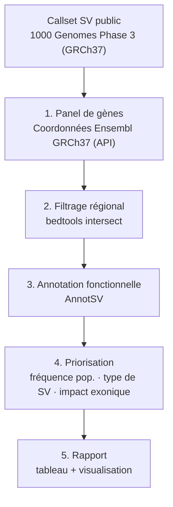

# cnv-clinical-pipeline

[](https://www.docker.com/)
[](LICENSE)

**Détection et priorisation de variants structuraux (CNV) dans un panel de gènes
cardiomyopathie/arythmie, à partir d'un callset public**

> Auteur : Romain KPAKOU | Master 2 Bioinformatique, Nantes Université
> GitHub : [github.com/romainkpakou](https://github.com/romainkpakou)

---

## Contexte et transparence sur les données

Ce dépôt reprend la méthodologie d'une analyse de CNV initialement menée sur une cohorte
clinique de 284 patients (prolapsus valvulaire mitral). **Les données patient originales ne
sont ni publiées ni publiables** ici (secret médical, RGPD). Ce pipeline démontre la même
chaîne d'analyse — filtrage régional, annotation fonctionnelle, priorisation — sur le
callset public **1000 Genomes Project (Phase 3, GRCh37)**, restreint à un panel de gènes
cardiaques d'intérêt.

Voir [PLAN.md](PLAN.md) pour le détail de la démarche et des choix méthodologiques.

---

## Pipeline



**Panel de gènes** (cardiomyopathies/arythmies) : `TTN`, `MYH7`, `LMNA`, `DSP`, `PKP2`,
`RBM20`, `DES` — coordonnées GRCh37 récupérées par script depuis l'API Ensembl, pas de
coordonnées codées en dur non vérifiées.

---

## Données

| Élément | Source | Taille |
|---|---|---|
| Callset SV | [1000 Genomes Phase 3 — integrated SV map](https://ftp.ebi.ac.uk/1000g/ftp/phase3/integrated_sv_map/) | ~18 Mo |
| Référence | GRCh37 (`hs37d5`) | — |
| Panel de gènes | API Ensembl GRCh37 REST | 7 gènes |

---

## Prérequis

| Outil | Installation |
|---|---|
| Docker | [docs.docker.com](https://docs.docker.com) |
| Python 3 (pour le script de récupération des coordonnées) | déjà présent sur la plupart des systèmes |

Tous les outils bioinformatiques (bcftools, bedtools, AnnotSV) tournent en conteneur
`quay.io/biocontainers` — aucune installation manuelle, mêmes images que
[`honeybee-gwas-pipeline`](https://github.com/romainkpakou/honeybee-gwas-pipeline) pour la
cohérence entre projets.

---

## Utilisation

```bash
# 1. Récupérer le panel de gènes (GRCh37, via Ensembl)
./scripts/00_build_gene_panel.sh

# 2. Télécharger le callset public (non versionné, voir data/raw/.gitignore)
mkdir -p data/raw
curl -sL -o data/raw/sv_calls.vcf.gz \
  https://ftp.ebi.ac.uk/1000g/ftp/phase3/integrated_sv_map/ALL.wgs.mergedSV.v8.20130502.svs.genotypes.vcf.gz

# 3. Filtrer sur le panel de gènes
./scripts/01_filter_region.sh

# 4. Annoter (API Ensembl VEP, GRCh37 — voir "Choix technique" ci-dessous)
python3 scripts/02_annotate_vep.py

# 5. Générer le rapport
docker run --rm --user "$(id -u):$(id -g)" -v "$(pwd):/proj" -w /proj/scripts rocker/tidyverse:4.3.1 \
  Rscript -e "rmarkdown::render('03_report.Rmd')"
mv scripts/03_report.html results/report.html
```

### Choix technique : VEP plutôt qu'AnnotSV

Le plan initial ([PLAN.md](PLAN.md)) prévoyait AnnotSV pour l'annotation fonctionnelle.
AnnotSV nécessite une base d'annotation locale de plusieurs Go — disproportionné pour
14 variants et pour la portabilité du dépôt. L'annotation utilise donc l'**API REST
Ensembl VEP** (GRCh37), qui fournit gene symbol, conséquences et impact fonctionnel
(Sequence Ontology) sans base à installer, avec les mêmes catégories d'information.

---

## Résultats

- **68 818** variants structuraux dans le callset brut (2 504 individus)
- **14** variants chevauchant le panel de 7 gènes cardiaques
- **4** variants d'impact fonctionnel HIGH selon VEP (tous dans *TTN* — voir interprétation
  dans le rapport, *TTN* étant tolérant à de nombreux SV en population générale)

Voir [`results/report.html`](results/report.html) pour le rapport complet (tableau
priorisé, graphique de répartition par impact, interprétation et limites).

## Limites

La cohorte 1000 Genomes est une population générale, pas des patients cardiopathes : les
CNV identifiés sont des **variants de population**, pas des variants pathogènes confirmés
cliniquement. Ce dépôt démontre la méthode, pas un diagnostic.

## Licence

MIT — voir [LICENSE](LICENSE).
